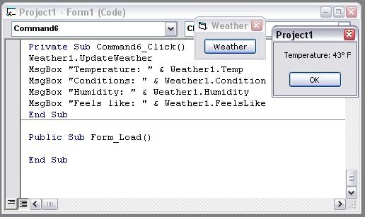



## Weather Parser \(user control, working\)

### Description

Includes sample project, FIXED file!
 
### More Info
 

             |
---                |---
**Submitted On**   |2002-01-17 20:18:20
**By**             |[James Balducci](https://github.com/Planet-Source-Code/PSCIndex/blob/master/ByAuthor/james-balducci.md)
**Level**          |Beginner
**User Rating**    |4.0 (8 globes from 2 users)
**Compatibility**  |VB 5\.0, VB 6\.0
**Category**       |[Internet/ HTML](https://github.com/Planet-Source-Code/PSCIndex/blob/master/ByCategory/internet-html__1-34.md)
**World**          |[Visual Basic](https://github.com/Planet-Source-Code/PSCIndex/blob/master/ByWorld/visual-basic.md)
**Archive File**   |[Weather\_Pa494701172002\.zip](https://github.com/Planet-Source-Code/james-balducci-weather-parser-user-control-working__1-30906/archive/master.zip)

